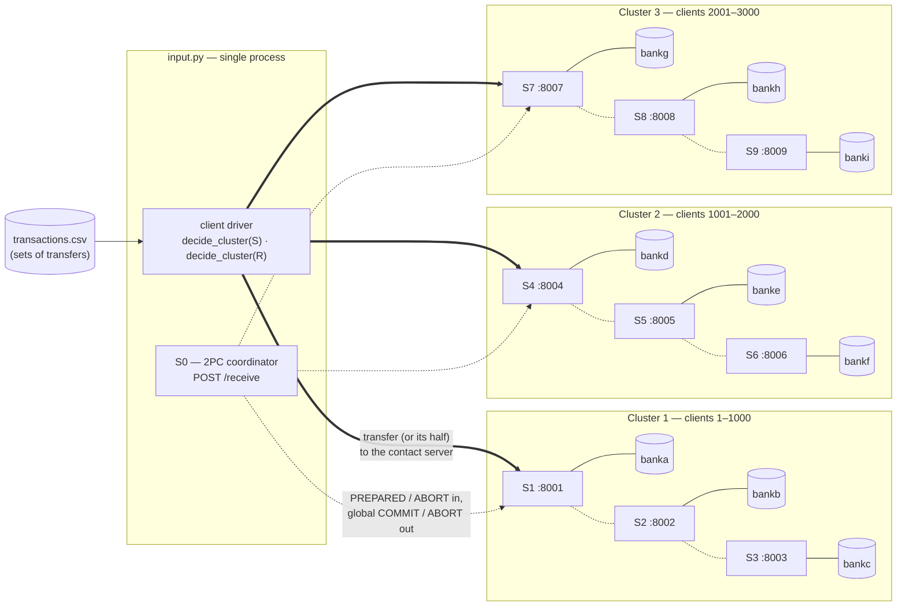
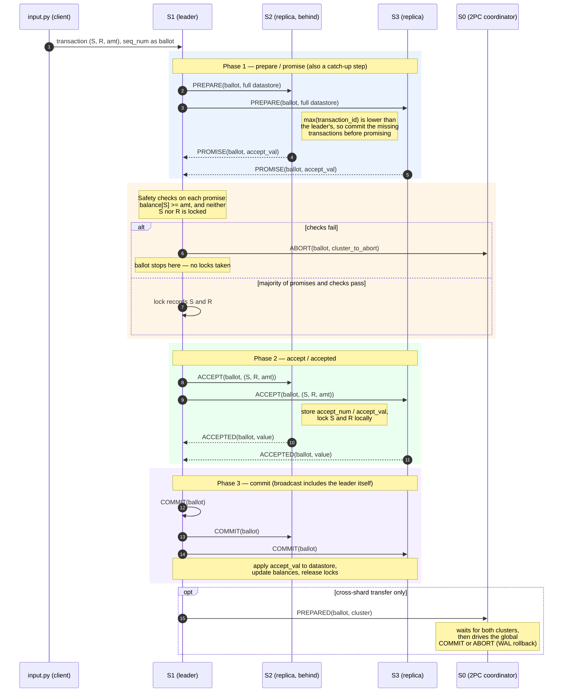

# Distributed Systems — Two-Phase Commit (2PC) over Paxos

A sharded banking system that processes money transfers across multiple server clusters.
Each cluster replicates its own shard of the data using **Paxos**, and transfers that span two
clusters are coordinated with the **Two-Phase Commit (2PC)** protocol, so transactions stay
consistent even when individual servers fail or a transfer must be aborted.

## Architecture



Every server is a FastAPI process exposing a single `POST /receive` endpoint; all Paxos and 2PC
messages — within a cluster and to the coordinator — travel over that one endpoint. Each server
owns a **private PostgreSQL database** (`banka` for `S1` through `banki` for `S9`), each holding its
own `datastore`, `keyvalue`, and `wal` tables; replicas within a cluster converge on identical
contents through Paxos rather than by sharing storage. Servers in a cluster are peers, so any of
them can lead a transaction — the driver picks the contact server per cluster from the CSV row.
The `S0` coordinator is not a separate process: `input.py` hosts it alongside the driver, so the
same process that dispatches transactions also collects the votes and issues the global decision
(rolling a shard back from its `wal` snapshot on abort).

## What the system does

Clients are partitioned across clusters (client IDs are assigned to clusters by range). A transfer
`(S, R, amt)` moves `amt` from client `S` to client `R`.

- **Intra-shard transfer** (sender and receiver in the same cluster): handled entirely by that
  cluster's Paxos group. One transaction, one consensus round.
- **Cross-shard transfer** (sender and receiver in different clusters): both clusters must agree.
  Each cluster runs Paxos locally to decide whether it *can* commit its half, reports `PREPARED`
  or `ABORT` to the coordinator (`S0`), and the coordinator drives the global commit/abort
  decision. A write-ahead log snapshot is taken before a cross-shard write so the shard can be
  rolled back.

Safety conditions checked before a cluster votes to commit:

- the sender's balance covers the amount, and
- neither the sender's nor the receiver's record is already locked by an in-flight transaction.

If either check fails, the cluster votes to abort and the whole transfer is rolled back.

## Protocol flow

```
PREPARE  ─▶  PROMISE  ─▶  ACCEPT  ─▶  ACCEPTED  ─▶  COMMIT       (Paxos, within a cluster)
                                          │
                                          ▼
                              PREPARED / ABORT  ─▶  coordinator S0  (2PC, across clusters)
```

### Paxos message flow inside a cluster

The sequence below traces one transaction through cluster 1, where `S1` is the contact server and
therefore the leader for this ballot. `S2` is assumed to be lagging, which triggers the
synchronization built into the prepare phase.



- `PREPARE` doubles as a **synchronization** step: the leader ships its datastore along with the
  prepare message, and any replica that is behind (lower max `transaction_id`) catches up by
  committing the missing transactions before replying with `PROMISE`.
- A leader proceeds to `ACCEPT` only after a **majority** of promises.
- `COMMIT` is broadcast to every replica, including the sender, and releases the record locks.

## Repository layout

| File | Purpose |
| --- | --- |
| `input.py` | Entry point. Reads the transaction CSV, decides sender/receiver clusters, dispatches transactions to servers, and hosts the `S0` coordinator endpoint (`/receive`) for `PREPARED`/`ABORT` messages. |
| `server.py` | `Server` — one replica. Owns its datastore, its Paxos instance, its lock table, and HTTP `send`/`broadcast` to peers. |
| `paxos.py` | `Paxos` — the consensus state machine: prepare/promise/accept/accepted/commit handlers, plus the cross-shard vote reporting. |
| `database.py` | `DataBase` — PostgreSQL persistence per server: the transaction `datastore` table, the `keyvalue` balance table, and the `wal` snapshot used for cross-shard rollback. |
| `models.py` | Pydantic models for `Transaction` and `Client`. |
| `config.json` | Cluster topology: number of clusters and servers per cluster. |

## Configuration

```json
{
  "num_clusters": 3,
  "cluster_size": 3
}
```

This yields 9 servers, `S1`–`S9`, mapped to clusters `1`, `2`, `3` in order. Ports are assigned
as `8000 + server_number`, so `S1` listens on `8001` and `S9` on `8009`. Each cluster owns 1000
client IDs.

## Setup

Requirements: Python 3.10+ (the code uses `str|int` type unions) and a running PostgreSQL 
instance.

```bash
pip install -r requirements.txt
```

Each server backs onto its own database named `bank<letter>` (`banka` for `S1`, `bankb` for `S2`,
and so on). Every database needs three tables:

```sql
CREATE TABLE public.datastore (
    sender         integer,
    receiver       integer,
    amount         integer,
    transaction_id integer,
    setid          integer
);

CREATE TABLE public.keyvalue (
    clientID integer PRIMARY KEY,
    amount   integer
);

CREATE TABLE public.wal (LIKE public.datastore);
```

Database connection settings live in `DataBase.connect_db` in `database.py`; update the host,
user, and password there to match your local PostgreSQL setup.

## Running

Start one server process per replica (ports `8001`–`8009` for the default 3×3 topology):

```bash
uvicorn server:app --port 8001
# ... repeat for each server in the topology
```

Then start the client driver:

```bash
python input.py
```

Set `file_path` in `input.py` to your transaction CSV first. The CSV is grouped into transaction
sets: a row whose first column holds a set number begins a new set, and the rows that follow
belong to it. Each row carries the transfer tuple `(S, R, amt)`, the list of live servers, and
the contact server per cluster.

At the prompt:

- enter a **set number** to run that set of transactions,
- enter `0` to print the current system status (balances and datastores),
- enter `-1` to shut down.

## Notes

- `main.py` is empty; `input.py` is the actual entry point.
- `S0` is the 2PC coordinator identity, not a Paxos replica and not a separate process — it is the
  `/receive` endpoint hosted by `input.py`.
